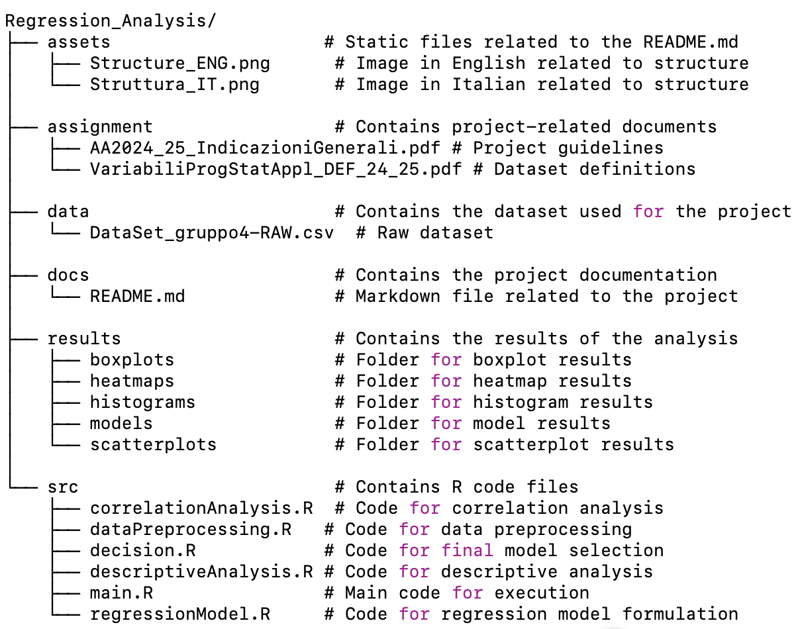

# Regression Analysis - Applied Statistics (ENG)

### Development Team:
- Mario Pellegrino Ambrosone
- Emanuele Barbato
- Luca Celentano
- Francesco De Bonis

### Project Overview:
The project focuses on regression analysis of a dataset. The main goal is to analyze the correlation between variables and construct a linear regression model to predict a dependent variable based on independent variables. Various statistical techniques will be applied, including descriptive analysis, hypothesis testing, and confidence interval estimation.

### Repository Structure:
- **data/**: Contains the dataset used for the project.
- **src/**: Contains the R code for analysis and regression model creation.
- **docs/**: Contains the project documentation in PDF format.
- **results/**: Contains the R code output.
- **README.md**: This file describing the project.
- **Regression_analysis.Rproj**: The RStudio project file.



### How to Run the Project:
1. Clone the repository:
    ```bash
    git clone https://github.com/Mario-cpu03/Regression_Analysis.git
    ```
2. Open the project in RStudio.
3. Run the scripts in the `src/` folder to perform the analysis.

### Contacts:
For questions or suggestions, contact:
- Mario Pellegrino Ambrosone: m.ambrosone12@studenti.unisa.it or marioambrosone03@gmail.com
- Emanuele Barbato: e.barbato7@studenti.unisa.it
- Luca Celentano: l.celentano14@studenti.unisa.it
- Francesco De Bonis: f.debonis4@studenti.unisa.it


--------------------------------------------------------------------


# Regression Analysis - Statistica Applicata (IT)

### Team di Sviluppo:
- Mario Pellegrino Ambrosone
- Emanuele Barbato
- Luca Celentano
- Francesco De Bonis

### Descrizione del progetto:
Il progetto riguarda l'analisi di regressione su un dataset. L'obiettivo principale è l'analisi di correlazione tra variabili e la costruzione di un modello di regressione lineare per prevedere una variabile dipendente in funzione di variabili indipendenti. Verranno applicate diverse tecniche statistiche tra cui analisi descrittiva, test di ipotesi e stima degli intervalli di confidenza.

### Struttura generale del repository:
- **data/**: Contiene il dataset utilizzato nel progetto.
- **src/**: Contiene il codice R per l'analisi e la creazione del modello di regressione.
- **docs/**: Contiene la documentazione del progetto in formato PDF.
- **results/**: Contiene i risultati elaborati dal codice.
- **README.md**: Questo file che descrive il progetto.
- **Regression_analysis.Rproj**: Il file del progetto RStudio.


### Come eseguire il progetto:
1. Clonare il repository:
    ```bash
    git clone https://github.com/Mario-cpu03/Regression_Analysis.git
    ```
2. Aprire il progetto in RStudio.
3. Eseguire gli script della cartella `src/` per eseguire l'analisi.

### Contatti:
Per domande o suggerimenti, contattare:
- Mario Pellegrino Ambrosone: m.ambrosone12@studenti.unisa.it o marioambrosone03@gmail.com
- Emanuele Barbato: e.barbato7@studenti.unisa.it
- Luca Celentano: l.celentano14@studenti.unisa.it
- Francesco De Bonis: f.debonis4@studenti.unisa.it
